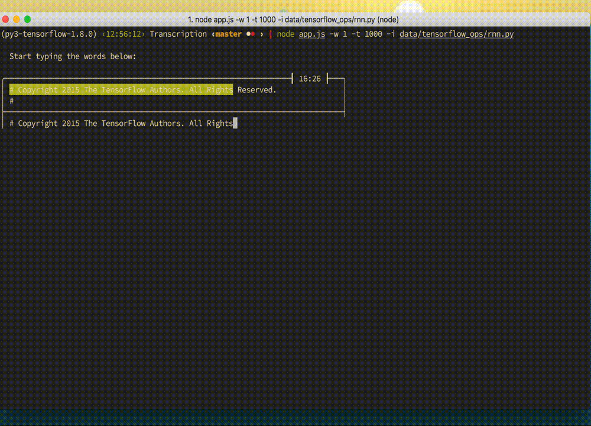

[](https://travis-ci.org/ApolloBian/Transcription)

Practice typing anything you like! Code, words, fictions, you name it.



## Install
##### manually
```
git clone https://github.com/ApolloBian/Transcription.git
cd Transcription
npm install .  # optional
node app.js
```

## Roadmap
feel free to contact me!
 - [x] support `^H` for deletion
 - [ ] wrap long lines
 - [ ] add coding mode:
    - support auto indention
 - [ ] add word list


## Dependecies
- [node.js](https://github.com/nodejs/node) >= 6.4.0
- ... That's it!

## Usage
```
node app.js [options]
```

##### Options:
- `-h, --help` Show help
- `-t, --time` Given time in seconds to complete the test
- `-w, --words` Number of words to display per line
- `-i, --input` Path to a wordlist file with new line separated words
- `-V, --verbose` Show settings on start
- `-s, --save` Path to file for saving results

##### Saving results

When called with the `-s, --save` option, results will be written to a file at the given path. Results are appended to the end of a tab-separated file so you can track your progress over time.

## Wordlists
You can use any text files as wordlist.
